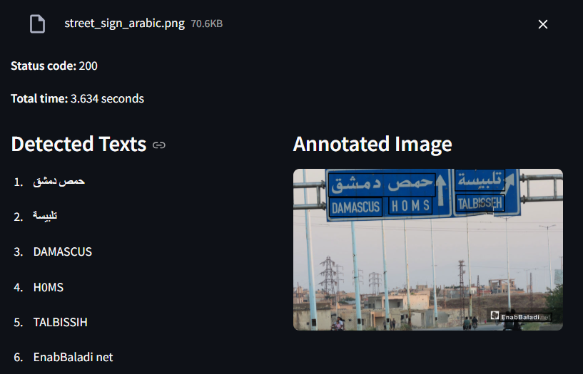
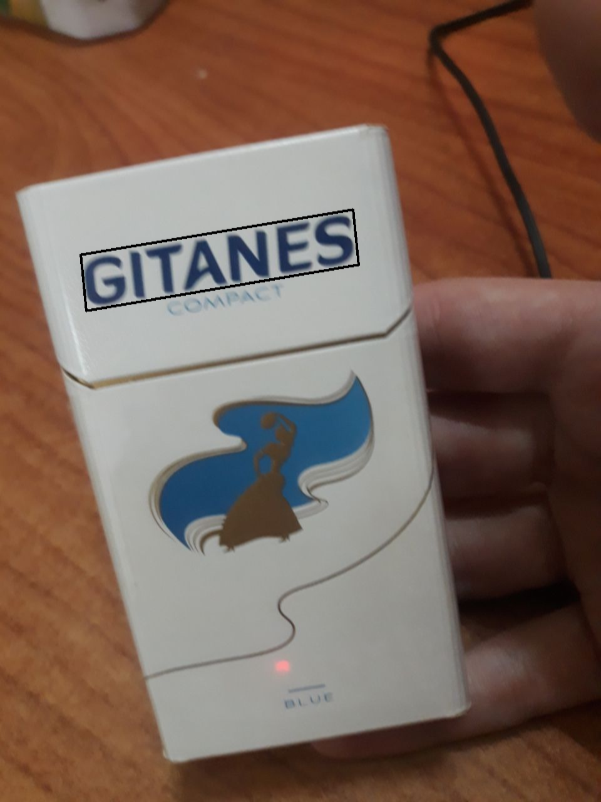

# SightMate - OCR Service 👁️

<div align="center">
  
</div>

A flexible and extensible Optical Character Recognition (OCR) service built with FastAPI and Python. The project follows Clean Architecture principles and implements the Hexagonal Architecture (Ports and Adapters) pattern to ensure loose coupling, maintainability, testability, and most importantly ML model switching flexibility.

## ✨ Features

- 🚀 FastAPI-based REST API
- 🔄 Easy model swapping through Factory and Registry patterns
- 🎯 High-accuracy text detection and recognition
- 📝 Support for multiple OCR models (PaddleOCR, EasyOCR, and others soon...)
- 🔧 Configurable through environment files
- 🐳 Easy deployment with Docker Compose

## 🤖 Supported OCR Models

### [PaddleOCR](https://github.com/PaddlePaddle/PaddleOCR)

- **Version**: PP-OCRv3
- **Features**:
  - High accuracy in text detection and recognition
  - Support for multiple languages
  - Fast inference using ONNX runtime
  - Robust against various image conditions
  - Real-time processing capabilities

### [EasyOCR](https://huggingface.co/qualcomm/EasyOCR)

- **Features**:
  - Support for 80+ languages
  - Built-in language detection
  - No GPU required
  - Easy to use and integrate
  - High accuracy in various scenarios
- **Note**:
  - Larger model size and slower inference compared to PaddleOCR, but offers more robust multilingual support

### [Gemma](https://ai.google.dev/gemma)

- **Version**: Gemma 3-4B
- **Features**:
  - Vision-language model capabilities
  - Advanced text understanding and description
  - Contextual understanding of text in images
  - Structured JSON output format
  - Configurable generation parameters
- **Note**:
  - Requires API access to Gemma model endpoint
  - Provides richer semantic understanding compared to traditional OCR models
  - Outputs include both detected text and contextual descriptions

The service is designed to easily integrate new OCR models through its modular architecture. Each model is implemented as an adapter that conforms to the `OCRPort` interface, making it simple to add support for additional OCR engines.

## 🏗️ Architecture

The project implements a Clean Architecture with Hexagonal Architecture (Ports and Adapters) pattern, providing a robust and maintainable structure:

```
src/
├── api/            # FastAPI routes and schemas (Adapters)
├── core/           # Core configuration and settings
├── domain/         # Domain models and ports (interfaces)
└── infrastructure/ # Concrete implementations and adapters
```

### 🔑 Key Components

1. **Domain Layer** 📦

   - Defines core business entities and interfaces
   - `OcrPort`: Abstract base class (Port) for OCR implementations
   - `OcrInput`/`OcrOutput`: Data transfer objects
   - Pure business logic, independent of external frameworks
   - Use cases

2. **Infrastructure Layer** 🏭

   - Contains concrete implementations (Adapters) of OCR models
   - Uses Factory and Registry patterns for model management
   - Implements ML models adapters
   - Handles external dependencies and technical details

3. **API Layer** 🌐
   - FastAPI routes and request/response schemas
   - Acts as a primary adapter for HTTP communication
   - Dependency injection for OCR model/api-key-repo selection

### 🎯 Hexagonal Architecture Benefits

- **Ports**: Define clear interfaces (`OCRPort`) for external interactions
- **Adapters**: Implement concrete solutions (PaddleOCR, EasyOCR) without affecting core logic
- **Domain Isolation**: Business rules remain independent of external frameworks
- **Testability**: Easy to mock external dependencies through ports
- **Flexibility**: Simple to swap implementations by creating new adapters

## 🛠️ Setup and Installation

### 1. Clone the repository

```bash
git clone https://github.com/Almouhannad/SightMate-OCR-Service.git
cd SightMate-OCR-Service
```

### 2. Configure Environment Variables

Create a `.env` file in the project root with the following content:

```env
# OCR model to use: paddleocr, easyocr, or gemma
OCR_ADAPTER=paddleocr
# API Key repository to use (e.g. mongo_db, in-memory, ...)
API_KEY_REPOSITORY=mongo_db

# MongoDB configuration
MONGO_HOST=mongo
MONGO_PORT=27017
MONGO_ROOT_USERNAME=your_mongo_root_username
MONGO_ROOT_PASSWORD=your_mongo_root_password
MONGO_DATABASE=your_database_name
# Application database and user
MONGO_DATABASE=ocr_service_database
MONGO_APP_USERNAME=ocr_service
MONGO_APP_PASSWORD=admin
MONGODB_URI=mongodb://${MONGO_APP_USERNAME}:${MONGO_APP_PASSWORD}@${MONGO_HOST}:${MONGO_PORT}/${MONGO_DATABASE}

# Required for Gemma adapter
LMS_API_BASE_URI_FOR_CONTAINER=your_gemma_api_base_uri  # Only needed if using gemma adapter

# Mongo Express credentials
ME_USERNAME=admin
ME_PASSWORD=admin
```

### 3. Run with Docker Compose

Make sure Docker and Docker Compose are installed, then run:

```bash
docker-compose up --build
```

- The API will be available at [http://localhost:9901](http://localhost:9901)
- Mongo Express UI at [http://localhost:9801](http://localhost:9801)

## 📡 API Endpoints

### 🔒 Authentication

All endpoints (except `/health`) require an API key via the `X-API-Key` header. See the API key management section below for details on how API keys are stored and validated.

### POST `/ocr/predict`

Process an image and return OCR results. **Requires authentication** via the `X-API-Key` header.

**Request:**

- Content-Type: application/json
- Header: `X-API-Key: <your-api-key>`
- Body:

```json
{
  "bytes": [...],  // List of image bytes
  "metadata": {},  // Optional metadata
  "options": {
    "lang": {
      "lang": "en"  // Language code (e.g., "en", "ar")
    }
  }
}
```

**Response:**

The response follows the `OcrOutput` schema (see [`src/domain/models.py`](src/domain/models.py)):

```json
{
  "texts": [
    {
      "text": "detected text",
      "confidence": 0.95,
      "box": {
        "left": 100,
        "top": 50,
        "right": 200,
        "bottom": 75
      }
    }
  ],
  "description": {}
}
```

- `texts`: List of detected text blocks, each with text, optional confidence, and bounding box.
- `description`: Optional additional information (may be empty or contain model-specific output).

### GET `/health`

A simple health check endpoint. Returns a 200 OK response if the service is running.

**Response:**

```json
{
  "status": "ok"
}
```


## 🔌 Adding New OCR Models

The service makes it easy to add new OCR models through the Factory and Registry patterns:

1. Create a new adapter class implementing `OCRPort`
2. Register it using the `@register_adapter` decorator
3. Update the configuration to use the new model

Example:

```python
from src.domain.ports import OCRPort
from src.infrastructure.models.registry import register_adapter

@register_adapter("new_model")
class NewOCRAdapter(OCRPort):
    def predict(self, data: OCRInput) -> OCROutput:
        # Implement OCR logic
        pass
```

## 🔑 API Key Management & Repository Pattern

The service uses a flexible, pluggable repository pattern for API key management, following the same clean architecture principles as the rest of the project. This allows you to easily swap out the backend for API key storage (e.g., MongoDB, in-memory, etc.).

**Key files and their roles:**

- [`src/domain/authentication/api_key_repository.py`](src/domain/authentication/api_key_repository.py): Abstract base class (`ApiKeyRepository`) defining the interface for API key storage and retrieval.
- [`src/domain/authentication/api_key.py`](src/domain/authentication/api_key.py): The core domain model for API keys, including logic for usage tracking.
- [`src/infrastructure/authentication/api_key_repositories/registry.py`](src/infrastructure/authentication/api_key_repositories/registry.py): Registry and decorator for registering and retrieving repository implementations by name.
- [`src/infrastructure/authentication/mongo_db/api_key_dto.py`](src/infrastructure/authentication/mongo_db/api_key_dto.py): Data Transfer Object (DTO) for MongoDB persistence, handling conversion between domain and database models.
- [`src/infrastructure/authentication/api_key_repositories/mongo_db/repository.py`](src/infrastructure/authentication/api_key_repositories/mongo_db/repository.py): Concrete implementation of `ApiKeyRepository` for MongoDB, using Motor for async access.


**How it works:**

- The repository interface (`ApiKeyRepository`) defines async methods for getting, creating, and updating API keys.
  - Api keys must be stored in DB/other backend using their hash values **(not plain-text)**, with usage of `key_prefix` for fast, indexed search
- The MongoDB implementation (`MongoDbApiKeyRepository`) is registered using a decorator and selected via configuration.
- The API key is validated for each request to `/ocr/predict` using a FastAPI dependency (see [`src/api/dependencies/authentication.py`](src/api/dependencies/authentication.py)).
- You can add new repository backends by implementing the interface, they'll be automatically registered, make sure to specify your backend name in `.env` (`API_KEY_REPOSITORY` field).


## 📸 More Screenshots

<div align="center">
  
  <br><br>
  
  <br><br>
  
</div>

## 🤝 Contributing

Contributions are welcome! Please feel free to submit a Pull Request.

## 🙏 Acknowledgments

- ChatGPT
- FastAPI for the fast API
- Teams created ML-based OCR models
- My friends because they are supportive
