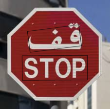

# SightMate - OCR Service 👁️

<div align="center">
  
</div>

A flexible and extensible Optical Character Recognition (OCR) service built with FastAPI and Python. The project follows Clean Architecture principles and implements the Hexagonal Architecture (Ports and Adapters) pattern to ensure loose coupling, maintainability, testability, and most importantly ML model switching flexibility.

## ✨ Features

- 🚀 FastAPI-based REST API
- 🔄 Easy model swapping through Factory and Registry patterns
- 🎯 High-accuracy text detection and recognition
- 📝 Support for multiple OCR models (currently PaddleOCR)
- 🖼️ Returns both text blocks and annotated images
- 🔧 Configurable through environment files

## 🤖 Supported OCR Models

### Current Model: [PaddleOCR](https://github.com/PaddlePaddle/PaddleOCR)
- **Version**: PP-OCRv3
- **Features**:
  - High accuracy in text detection and recognition
  - Support for multiple languages
  - Fast inference using ONNX runtime
  - Robust against various image conditions
  - Real-time processing capabilities

### Upcoming Models
- [**EasyOCR**](https://huggingface.co/qualcomm/EasyOCR)
  - Support for 80+ languages
  - Built-in language detection
  - No GPU required
  - Easy to use and integrate

The service is designed to easily integrate new OCR models through its modular architecture. Each model is implemented as an adapter that conforms to the `OCRPort` interface, making it simple to add support for additional OCR engines.

## 🏗️ Architecture

The project implements a Clean Architecture with Hexagonal Architecture (Ports and Adapters) pattern, providing a robust and maintainable structure:

```
src/
├── api/            # FastAPI routes and schemas (Adapters)
├── core/           # Core configuration and settings
├── domain/         # Domain models and ports (interfaces)
├── infrastructure/ # Concrete implementations and adapters
└── use_cases/      # Business logic and use cases
```

### 🔑 Key Components

1. **Domain Layer** 📦
   - Defines core business entities and interfaces
   - `OCRPort`: Abstract base class (Port) for OCR implementations
   - `OCRInput`/`OCROutput`: Data transfer objects
   - Pure business logic, independent of external frameworks

2. **Infrastructure Layer** 🏭
   - Contains concrete implementations (Adapters) of OCR models
   - Uses Factory and Registry patterns for model management
   - Implements ML models adapters
   - Handles external dependencies and technical details

3. **API Layer** 🌐
   - FastAPI routes and request/response schemas
   - Acts as a primary adapter for HTTP communication
   - Dependency injection for OCR model selection

### 🎯 Hexagonal Architecture Benefits

- **Ports**: Define clear interfaces (`OCRPort`) for external interactions
- **Adapters**: Implement concrete solutions (PaddleOCR, EasyOCR) without affecting core logic
- **Domain Isolation**: Business rules remain independent of external frameworks
- **Testability**: Easy to mock external dependencies through ports
- **Flexibility**: Simple to swap implementations by creating new adapters

## 🛠️ Setup and Installation

1. Clone the repository:
```bash
git clone https://github.com/Almouhannad/SightMate-OCR-Service.git
cd SightMate-OCR-Service
```

2. Create a virtual environment and activate it:
```bash
python -m venv venv
source venv/bin/activate  # On Windows: venv\Scripts\activate
```

3. Install dependencies:
```bash
pip install -r requirements.txt
```

4. Download the required model files and place them in the `models/` directory

5. Create a `.env` file with your configuration:
```env
OCR_ADAPTER=paddleocr
```

## 🚀 Running the Service

Start the FastAPI server:
```bash
uvicorn src.api.main:app --reload
```

## 📡 API Endpoints

### POST /ocr/predict
Process an image and return OCR results.

**Request:**
- Content-Type: multipart/form-data
- Body: image file

**Response:**
```json
{
  "result": {
    "blocks": [
      {
        "text": "detected text"
      }
    ],
    "annotated_image": "base64 encoded image"
  }
}
```

## 🔌 Adding New OCR Models

The service makes it easy to add new OCR models through the Factory and Registry patterns:

1. Create a new adapter class implementing `OCRPort`
2. Register it using the `@register_adapter` decorator
3. Update the configuration to use the new model

Example:
```python
from src.domain.ports import OCRPort
from src.infrastructure.models.registry import register_adapter

@register_adapter("new_model")
class NewOCRAdapter(OCRPort):
    def predict(self, data: OCRInput) -> OCROutput:
        # Implement OCR logic
        pass
```

## 📸 More Screenshots

<div align="center">
  
  <br><br>
  
  <br><br>
  
</div>

## 🤝 Contributing

Contributions are welcome! Please feel free to submit a Pull Request.

## 🙏 Acknowledgments

- ChatGPT
- FastAPI for the fast API
- Teams created ML-based OCR models
- My friends because they are supportive
